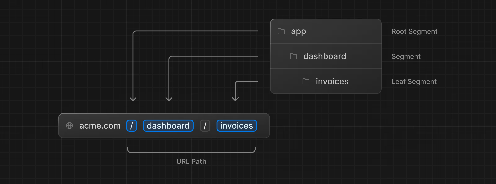
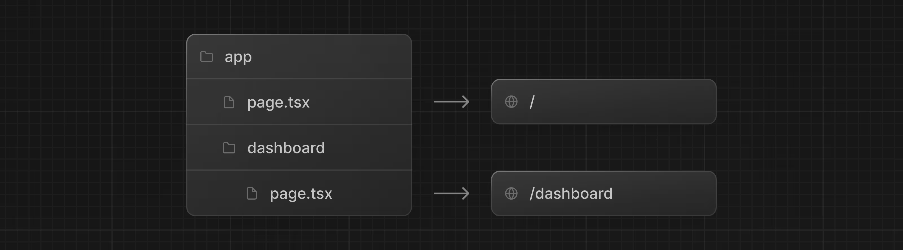
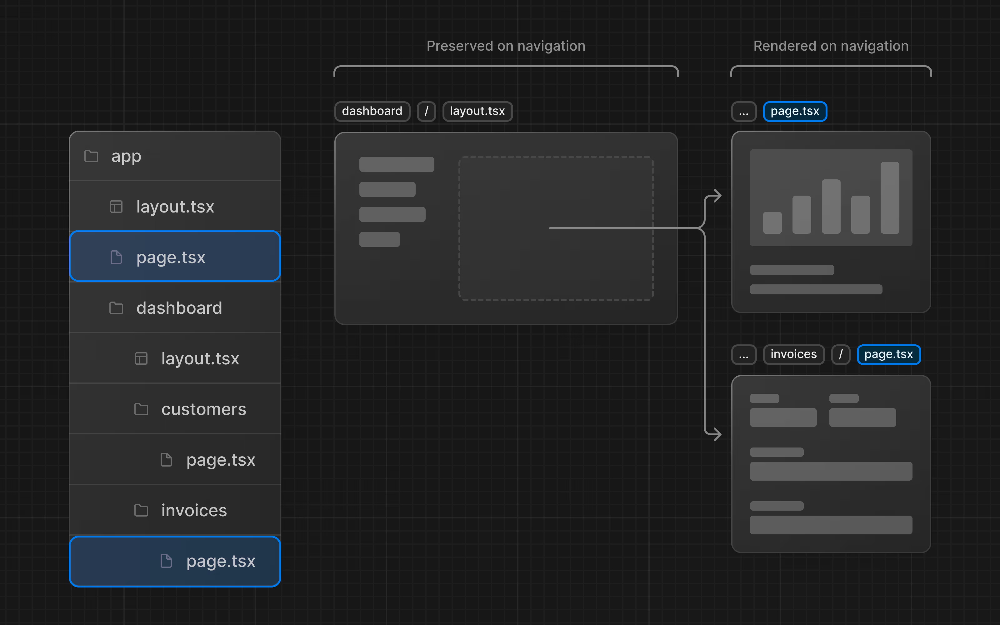
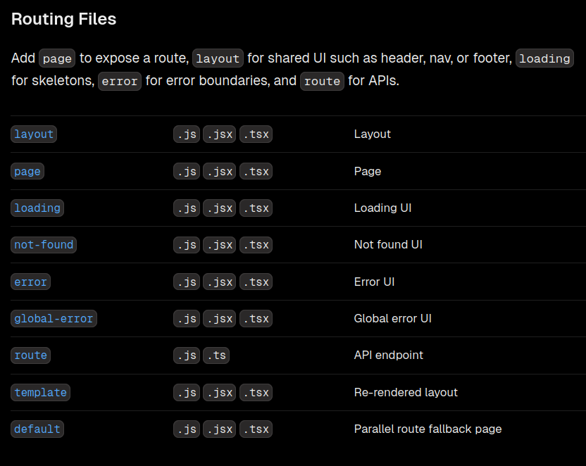

Nested routing

Next.js uses file-system routing where folders are used to create nested routes. Each folder represents a route segment that maps to a URL segment.
Diagram showing how folders map to URL segments!

One benefit of using layouts in Next.js is that on navigation, only the page components update while the layout won't re-render. This is called partial rendering which preserves client-side React state in the layout when transitioning between pages.

Routing Files

